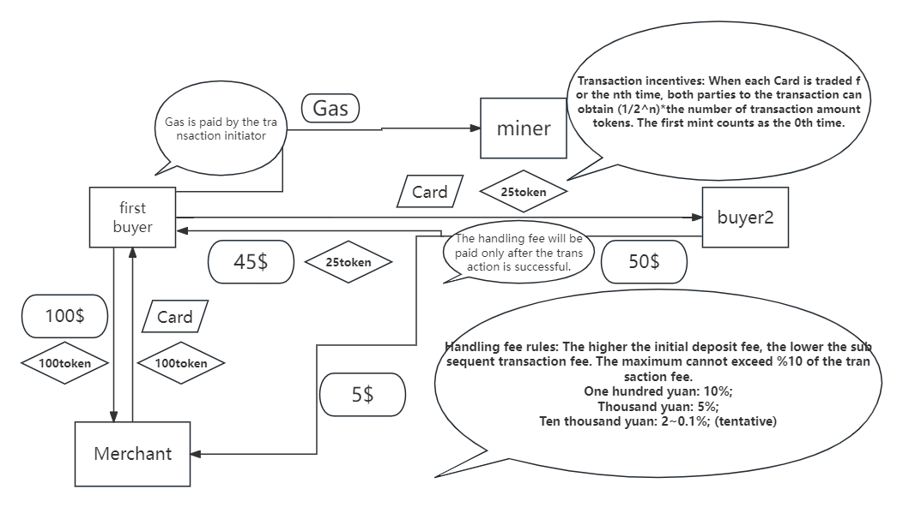
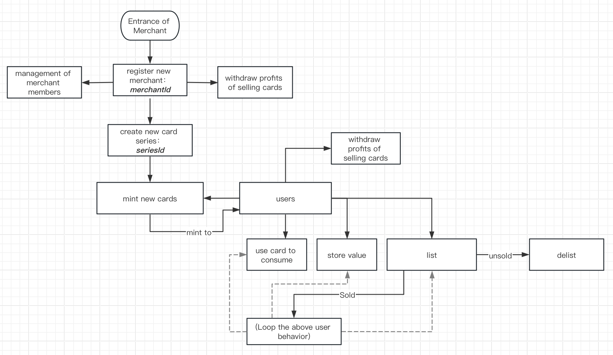

# Win-Win Card WhitePaper(English Version)
[Project Files Path](./app/back-end/contract)
### 1. Brief Description

In recent years, various conflicts between merchants and users due to prepaid stored-value cards have occurred frequently. More and more people of all ages have been deceived, causing the trust between merchants and consumers to basically disappear, and Rights protection requires additional financial resources, manpower, and energy that are far greater than the value of the recharge card itself. Once consumers pay, they fall into a situation where the control is completely in the hands of the merchants, and some even do things like tricking consumers (usually young college students) into taking loans and charging cards. So how can we break this situation? How can we give consumers the power they deserve so that merchants can be willing to participate, and at the same time, they can transfer the cards under the witness of both parties? Blockchain provides a solution that is close to The perfect solution.

### 2. Core Business Processes

- An abstraction of prepaid stored-value cards that provide various offline services

- Provide a three-party mutually beneficial blockchain system

- Provide card circulation platform

- Real-time on-chain data

### 3. Innovation

- Abstracting the merchant's self-issued stored-value card business into NFT on the chain allows customers to have more rights, instead of just the merchant having the right to explain after paying the money.

- It provides users with the opportunity and platform for secondary circulation of recharge cards, where users can easily trade and merchants can also make profits.

- While giving more practical meaning to NFT that is separated from real life, we can make full use of the characteristics of NFT.

- Using the theory of game theory, merchants can participate in this system on the premise of giving up part of the profits.

### 4. Usage Scenarios

- Recharge card business for small and medium-sized merchants.

- Gift card.

- Other virtual assets.

### 5. Flow Diagrams

#### CardMarket

#### Card

### 6. Functions Realized

#### a. Implementation Functions of {CardMarket}

- Basic Functions:
  - buy card
  - Validate User‘s Membership of A Whitelist
  - Incentives of cards transfer
- More Functions:
  - Airdrop(coupons, admission tickets)
  - Card packs
  - limited release of cards

#### b. Technical implementation

To help understand the implementation of cards, the relevant concepts and implementation are briefly described as follows:

- ##### Card

  - **card series**: For example, a certain merchant may issue multiple <u>card series</u>, and the features of the same <u>card series</u> are consistent. In order to allow the same merchant to issue multiple <u>card series</u>, each card series is an unique ERC-721 token contract, and `seriesId` is used as the <u>unique identifier</u> of the <u>card series</u>. The implementation logic is provided by the contract `CardSeries`. Each card series is a `CardSeries` contract instance deployed through a minimal agent.
  - **card**: A single card in a certain <u>card series</u>, which is cast and generated by the <u>merchant member</u> . It can be used for consumption, storing value, listing, resale, etc. Each card corresponds to an unique <u>`tokenId`</u> in  `CardSeries` contract (a superset of a contract instance of ERC-721).

- ##### Merchant

  The "project party" that issues cards need to *register* its own `merchantId` to enter the platform. <u>Each merchant corresponds to an unique `merchantId`</u>. The same `merchantId` can have multiple members (i.e. addresses) to invoke the functions related to the merchant, with `merchantId` as the **unique identifier** of the **merchant**.

# Win-Win Card WhitePaper(Chinese Version)

[工程路径](./app/back-end/contract)

#### 问题分析

近年来，各类因预付储值卡发生在商家和用户之间的矛盾频频出现，越来越多的各年龄段的人上当受骗，导致商家与消费者之间的信任基本消失殆尽，而维权需要耗费额外的财力，人力，精力远远大于充值卡本身的价值。一旦消费者付了钱，就陷入了控制权完全掌握在商家的手里的局面，更有甚者还做出哄骗消费者（一般为年轻大学生）贷款充卡这样的勾当。那么要怎么样才能打破这个局面呢，如何赋予消费者应有权力的情况下，商家也能愿意参与，同时还能在双方的共同见证下将卡进行转移流通，区块链给出了近乎于完美的解决方案。

#### 核心业务流程

1. 提供各种线下服务预付储值卡的抽象

   

2. 提供三方互利的区块链系统

   

3. 提供卡流通平台

   

4. 实时链上数据

#### 创新点

1. 将商家自发行的储值卡业务抽象为链上的NFT，使客户能拥有更多的权力，而不仅仅是交完钱后解释权由商家所有。
2. 给用户提供了充值卡二次流通的机会和平台，用户可轻松交易并且商家也能在其中获利。
3. 将与现实生活分离的NFT赋予更多的现实意义的同时，充分利用NFT的特性。
4. 利用博弈论的理论，使商家在让利一部分的前提下也能参与到此此系统中来。

#### 使用场景

1. 中小型商家的充值卡业务。
2. 礼品卡
3. 其他虚拟资产

#### 具体思路

##### CardMarket

##### Card

### 实现

### CardMarket合约实现功能

##### 基础功能：

1. 实现交易功能：buy
2. 实现验证白名单功能
3. 交易激励功能

##### 更多功能

1. 空投功能（优惠卷，体验卷）
2. 卡包功能
3. 限量发行l';

### “会员卡”的技术实现与说明

#### A. 概念解释与说明

为帮助理解“会员卡”的实现，现将相关的名词概念与实现简述如下：

- **会员卡（card）**：
  - **一套会员卡（card series）**：例如，某一个商家可能发行多套会员卡，同一套会员卡的特性是一致的。为了满足同一个商家发行多套会员卡，<u>一套会员卡为独立的一个 ERC-721 token 合约，并以`seriesId`作为**会员套卡**的**唯一标识符**</u>。由合约`CardSeries`提供实现逻辑，每一套会员卡都是通过最小代理部署的`CardSeries`合约实例。
  - **一张会员卡（token）**：某套会员卡中的单张会员卡，这是会员卡的基本单位，由**商家**铸造生成或由用户 *claim* 获得（需**商家**提前构建白名单）。可用于消费、充值、上架、转售等。<u>每一张卡都对应于 ERC-721 token 合约（`CardSeries`合约实例）中独立的`tokenId`</u>。
- **商家（merchant）**：发行“会员卡”的“项目方”，每个商家入驻本平台均需要 *注册* 自己的`merchantId`，<u>每一个商家对应于独立的一个 `merchantId`</u>。同一个`merchantId`可拥有多个成员（即地址），以`merchantId`作为**商家**的**唯一标识符**。由合约`CardsFactory`管理。

