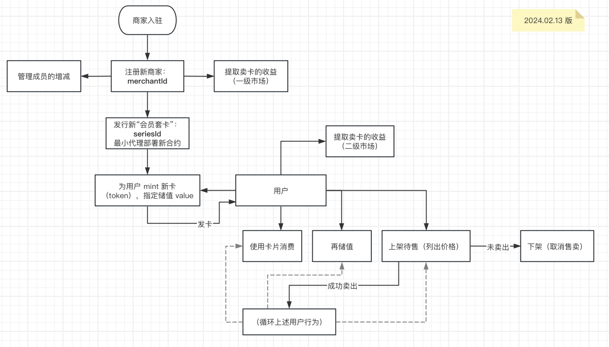

# “会员卡”的技术实现与说明

## A. 概念解释与说明

为帮助理解“会员卡”的实现，现将相关的名词概念与实现简述如下：

- **会员卡（card）**：
  - **一套会员卡（card series）**：例如，某一个商家可能发行多套会员卡，同一套会员卡的特性是一致的。为了满足同一个商家发行多套会员卡，<u>一套会员卡为独立的一个 ERC-721 token 合约，并以`seriesId`作为**会员套卡**的**唯一标识符**</u>。由合约`CardSeries`提供实现逻辑，每一套会员卡都是通过最小代理部署的`CardSeries`合约实例。
  - **一张会员卡（token）**：某套会员卡中的单张会员卡，这是会员卡的基本单位，由**商家**铸造生成或由用户 *claim* 获得（需**商家**提前构建白名单）。可用于消费、充值、上架、转售等。<u>每一张卡都对应于 ERC-721 token 合约（`CardSeries`合约实例）中独立的`tokenId`</u>。
- **商家（merchant）**：发行“会员卡”的“项目方”，每个商家入驻本平台均需要 *注册* 自己的`merchantId`，<u>每一个商家对应于独立的一个 `merchantId`</u>。同一个`merchantId`可拥有多个成员（即地址），以`merchantId`作为**商家**的**唯一标识符**。由合约`CardsFactory`管理。

以下流程图可示意以上说明内容：




## B. 合约代码与说明

使用两个合约来实现会员卡的功能以及相关方法：

- **会员套卡合约 `CardSeries`**：实现单套会员卡的特性与功能，为克隆新的合约实例提供“模板”。

- **工厂合约 `CardsFactory`**：通过最小代理部署新的 token 合约作为新的“会员套卡”，同时也是商家和用户的“客户端”合约，通过此合约可直接调用**`CardSeries`**合约中的方法。

--------

### 1. `CardSeries`合约（实现卡片的内在逻辑）

#### 1-1-1. 完整代码（`ICardSeries`接口）

```solidity
//SPDX-License-Identifier: MIT
pragma solidity ^0.8.19;

interface ICardSeries {
    /**
     * @dev Emitted when a Merkle proof is validated successfully.
     */
    event validatedForCardClaimed(string tokenURI, address user);

    /**
     * @dev Indicates a failure with `caller`. Used in checking if the caller equals `factory`.
     */
    error notFactory(address caller);

    /**
     * @dev Indicates a failure with `currentTimestamp` and `deadline`. Used in checking if a signature of a signed message out is expired.
     */
    error expiredSignature(uint256 currentTimestamp, uint256 deadline);

    /**
     * @dev Indicates a failure with the signer derived from a signature and the valid signer. Used in signature validation.
     */
    error Unapproved(address derivedSigner, address validSigner);

    /**
     * @dev Indicates a failure. Used in checking if the current supply of the cards has reached `maxSupply`.
     */
    error reachMaxSupply();

    /**
     * @dev Indicates a failure. Used in checking if `msg.sender` equals the owner of the card.
     */
    error notCardOwner();

    /**
     * @dev Indicates a failure when {init} is not called after the deployment of the current contract. Used in checking if `factory` is initialized with a value of a non-address(0) address.
     */
    error uninitialized();

    /**
     * @dev Indicates a failure when any account(address) calls {approve}.
     */
    error externalApproveBanned();

    /**
     * @dev Indicates a failure with `inputAddr`. Used in checking if the input address is applicable to the function called.
     */
    error invalidAddress(address inputAddr);

    /**
     * @dev Because the constructor does not work when this contract is deployed via minimal proxy, this function will initialize 
     * the state variables of itself and its parent contract(s).
     *
     * Note that {init} should only be called once at the moment of the deployment of this contract.
     */
    function init(address _factoryAddr, uint256 _merchantId, uint256 _seriesId, string calldata _seriesName, string calldata _seriesSymbol, uint256 _maxSupply) external;

    /**
     * @notice Merchant mints a new card to `_to` with an originally stored value(count in token).
     *
     * @param _to the recipient of the minted card
     * @param _tokenURI a custom string which is stored in the card
     *
     * @return tokenId a unique ID of the card minted directly returned by internal function {_mintCard}.
     *
     * Note `tokenId` starts from 0 and ends at `maxSupply`.
     */
    function mintCard(address _to, string calldata _tokenURI) external returns (uint256);

    /**
     * @dev Generate a hash of the combination of a typehash and a message based on the parameters.
     *
     * @param _ownerOfAVAX the address of the minted card repicient that pays AVAX for the card
     * @param _price the value of AVAX in exchange for the minted card
     */
    function permitForMint_buildHash(address _ownerOfAVAX, uint256 _merchantId, uint256 _seriesId, uint256 _price, uint256 _deadline) external returns (bytes32);

    /**
     * @dev Validate the given signature before transfer AVAX when mint a card.
     *
     * @param _ownerOfAVAX the address of the minted card repicient that pays AVAX for the card
     * @param _hash a bytes32 variable which should be generated by {permitForMint_buildHash}
     * @param _signature the signature given by the recipient, which indicates the recipient has approved the message signed
     */
    function permitForMint_validateSig(address _ownerOfAVAX, bytes32 _hash, bytes memory _signature) external pure;

    /**
     * @notice To meet the demand of distributing cards to multiple users, the merchant can make a whitelist containing the member addresses and stored values inside the card.
     * Users who are in the whitelist can call {validateCardClaim} to get their cards.
     * The membership of the whitelist should be in the form of a Merkle tree.
     *
     * @param _MerkleProof a dynamic array which contains Merkle proof is used for validating the membership of the caller. This should be offered by the project party
     * @param _MerkleRoot the root of the Merkle tree of the whitelist
     * @param _tokenURI a custom string which is stored in the card
     */
    function validateCardClaim(bytes32[] calldata _MerkleProof, bytes32 _MerkleRoot, string calldata _tokenURI) external;

    /**
     * @notice When a specific card(specified by input '_tokenId') is assigned to be operated by calling this function with a signed message,
     * this function will check if the signer of the signed message equals the owner of the card.
     * Once the signature is successfully validated, the card will be approved to `_operator`.
     * The splitted parts('_v', "_r", "_s") of the signed message, are checked for the validity of the signature.
     *
     * @param _operator the address which is able to control the signer's card
     * @param _tokenId the specific tokenId of the card series which is assigned to be listed
     * @param _data the array of bytes which includes the necessary information to be signed
     * @param _deadline the expire timestamp of the input signed message
     * @param _v ECDSA signature parameter v
     * @param _r ECDSA signature parameter r
     * @param _s ECDSA signature parameter s
     */
    function cardPermit(address _operator, uint256 _tokenId, bytes[] calldata _data, uint256 _deadline, uint8 _v, bytes32 _r, bytes32 _s) external returns (bool);

    /**
     * @dev Conduct the action of card transfer. The card will be transferred from the owner of the card to `_to`.
     *
     * Emits a {Transfer} event.
     */
    function executeCardTransfer(address _to, uint256 _tokenId) external;

    /**
     * @notice Get the `merchantId` of the current card series.
     */
    function getMerchantId() external view returns (uint256);

    /**
     * @notice Get the `seriesId` of the current card series.
     */
    function getSeriesId() external view returns (uint256);

    /**
     * @notice Get the `currentSupply` of the current card series.
     */
    function getCurrentSupply() external view returns (uint256);

    /**
     * @notice Get the `cardBalance` of the current card series.
     */
    function getCardBalance(uint256 _tokenId) external view returns (uint256);

    /**
     * @notice Get the `transNum` of the card corresponding to the input `_tokenId`.
     */
    function getTransNum(uint256 _tokenId) external view returns (uint256);
}
```


#### 1-1-2. 完整代码（基于`ICardSeries`接口的合约实现）

```solidity
//SPDX-License-Identifier: MIT
pragma solidity ^0.8.19;

import "@openzeppelin/contracts/token/ERC721/extensions/ERC721URIStorage.sol";
import "@openzeppelin/contracts/token/ERC721/IERC721.sol";
import "./ICardSeries.sol";
import {Nonces} from "@openzeppelin/contracts/utils/Nonces.sol";
import {ECDSA} from "@openzeppelin/contracts/utils/cryptography/ECDSA.sol";
import {EIP712Upgradeable} from "@openzeppelin/contracts-upgradeable/utils/cryptography/EIP712Upgradeable.sol";
import "@openzeppelin/contracts/utils/cryptography/MerkleProof.sol";

/**
 * @title The implementation contract which realizes the basic logic of membership cards.
 *
 * @dev Implementation of the {ICardSeries} interface.
 */
contract CardSeries is ICardSeries, ERC721URIStorage, EIP712Upgradeable, Nonces {
    address public factory;
    uint256 private merchantId;
    uint256 private seriesId;
    string private cardName;
    string private cardSymbol;
    uint256 private currentSupply;
    uint256 public maxSupply;
    mapping(uint256 tokenId => uint256 tokenValue) internal cardBalance;
    mapping(uint256 tokenId => uint256 numOfTransferred) internal transNum;

    constructor() ERC721("XiJianChui", "XJC") {}

    /**
     * @dev Because the constructor does not work when this contract is deployed via minimal proxy, this function will initialize 
     * the state variables of itself and its parent contract(s).
     *
     * Note that {init} should only be called once at the moment of the deployment of this contract.
     */
    function init(
        address _factoryAddr,
        uint256 _merchantId,
        uint256 _seriesId,
        string calldata _seriesName,
        string calldata _seriesSymbol,
        uint256 _maxSupply
    ) external initializer {
        factory = _factoryAddr;
        merchantId = _merchantId;
        seriesId = _seriesId;
        cardName = _seriesName;
        cardSymbol = _seriesSymbol;
        maxSupply = _maxSupply;
        __EIP712_init(_seriesName, "1");
    }

    /**
     * @dev Check if the existence of the non-address(0) value of `factory` and if the caller equals `factory`.
     */
    modifier onlyFactory() {
        if (factory == address(0)) {
            revert uninitialized();
        }
        if (msg.sender != factory) {
            revert notFactory(msg.sender);
        }
        _;
    }

    /**
     * @notice Merchant mints a new card to `_to` with an originally stored value(count in token).
     *
     * @param _to the recipient of the minted card
     * @param _tokenURI a custom string which is stored in the card
     *
     * @return tokenId a unique ID of the card minted directly returned by internal function {_mintCard}.
     *
     * Note `tokenId` starts from 0 and ends at `maxSupply`.
     */
    function mintCard(address _to, string calldata _tokenURI) external onlyFactory returns (uint256) {
        return _mintCard(_to, _tokenURI);
    }

    /**
     * @dev Generate a hash of the combination of a typehash and a message based on the parameters.
     *
     * @param _ownerOfAVAX the address of the minted card repicient that pays AVAX for the card
     * @param _price the value of AVAX in exchange for the minted card
     */
    function permitForMint_buildHash(address _ownerOfAVAX, uint256 _merchantId, uint256 _seriesId, uint256 _price, uint256 _deadline) external returns (bytes32) {
        bytes32 PERMIT_TYPEHASH =
            keccak256("PermitForMintCard(uint256 merchantId,uint256 seriesId,uint256 price,uint256 signerNonce,uint256 deadline)");
        if (block.timestamp > _deadline) {
            revert expiredSignature(block.timestamp, _deadline);
        }
        bytes32 structHash = keccak256(abi.encode(PERMIT_TYPEHASH, _merchantId, _seriesId, _price, _useNonce(_ownerOfAVAX), _deadline));
        bytes32 hash = _hashTypedDataV4(structHash);
        return hash;
    }

    /**
     * @dev Validate the given signature before transfer AVAX when mint a card.
     *
     * @param _ownerOfAVAX the address of the minted card repicient that pays AVAX for the card
     * @param _hash a bytes32 variable which should be generated by {permitForMint_buildHash}
     * @param _signature the signature given by the recipient, which indicates the recipient has approved the message signed
     */
    function permitForMint_validateSig(address _ownerOfAVAX, bytes32 _hash, bytes memory _signature) external pure {
        require(_signature.length == 65, "invalid signature length");
        uint8 _v;
        bytes32 _r;
        bytes32 _s;
        assembly {
            _r := mload(add(_signature, 0x20))
            _s := mload(add(_signature, 0x40))
            _v := byte(0, mload(add(_signature, 0x60)))
        }
        address signer = ECDSA.recover(_hash, _v, _r, _s);
        if (signer != _ownerOfAVAX) {
            revert Unapproved(signer, _ownerOfAVAX);
        }
    }

    /**
     * @notice To meet the demand of distributing cards to multiple users, the merchant can make a whitelist containing the member addresses and stored values inside the card.
     * Users who are in the whitelist can call {validateCardClaim} to get their cards.
     * The membership of the whitelist should be in the form of a Merkle tree.
     *
     * @param _MerkleProof a dynamic array which contains Merkle proof is used for validating the membership of the caller. This should be offered by the project party
     * @param _MerkleRoot the root of the Merkle tree of the whitelist
     * @param _tokenURI a custom string which is stored in the card
     */
    function validateCardClaim(
        bytes32[] calldata _MerkleProof,
        bytes32 _MerkleRoot,
        string calldata _tokenURI
    ) external {
        bytes32 leaf = keccak256(abi.encodePacked(msg.sender, _tokenURI));
        _verifyMerkleProof(_MerkleProof, _MerkleRoot, leaf);
        emit validatedForCardClaimed(_tokenURI, msg.sender);
    }

    /**
     * @notice When a specific card(specified by input '_tokenId') is assigned to be operated by calling this function with a signed message,
     * this function will check if the signer of the signed message equals the owner of the card.
     * Once the signature is successfully validated, the card will be approved to `_operator`.
     * The splitted parts('_v', "_r", "_s") of the signed message, are checked for the validity of the signature.
     *
     * @param _operator the address which is able to control the signer's card
     * @param _tokenId the specific tokenId of the card series which is assigned to be listed
     * @param _data the array of bytes which includes the necessary information to be signed
     * @param _deadline the expire timestamp of the input signed message
     * @param _v ECDSA signature parameter v
     * @param _r ECDSA signature parameter r
     * @param _s ECDSA signature parameter s
     */
    function cardPermit(address _operator, uint256 _tokenId, bytes[] calldata _data, uint256 _deadline, uint8 _v, bytes32 _r, bytes32 _s)
        external
        onlyFactory
        returns (bool)
    {
        address cardOwner = ownerOf(_tokenId);
        bytes32 PERMIT_TYPEHASH =
            keccak256("cardPermit(address operator,uint256 tokenId,bytes[] _data,uint256 signerNonce,uint256 deadline)");
        if (block.timestamp > _deadline) {
            revert expiredSignature(block.timestamp, _deadline);
        }

        bytes32 structHash =
            keccak256(abi.encode(PERMIT_TYPEHASH, _operator, _tokenId, _data, _useNonce(cardOwner), _deadline));

        bytes32 hash = _hashTypedDataV4(structHash);

        address signer = ECDSA.recover(hash, _v, _r, _s);
        if (signer != cardOwner) {
            revert Unapproved(signer, cardOwner);
        }
        return true;
    }

    /**
     * @dev Conduct the action of card transfer. The card will be transferred from the owner of the card to `_to`.
     *
     * Emits a {Transfer} event.
     */
    function executeCardTransfer(address _to, uint256 _tokenId) public onlyFactory {
        address cardOwner = ownerOf(_tokenId);
        if (_to == cardOwner || _to == address(0)) {
            revert invalidAddress(_to);
        }
        safeTransferFrom(msg.sender, _to, _tokenId);
        transNum[_tokenId]++;
    }

    /**
     * @notice The external function {approve} of the contract {ERC721} is banned in this contract.
     *
     * Note that any cards should keep their approval to `factory` at any time.
     */
    function approve(address to, uint256 tokenId) public pure override(ERC721, IERC721) {
        revert externalApproveBanned();
    }

    /**
     * @notice The external function {setApprovalForAll} of the contract {ERC721} is banned in this contract.
     *
     * Note that any cards should keep their approval to `factory` at any time.
     */
    function setApprovalForAll(address operator, bool approved) public pure override(ERC721, IERC721) {
        revert externalApproveBanned();
    }

    /**
     * @dev The internal function {_mintCard} realizes the basic logics of minting a new card.
     */
    function _mintCard(address _to, string memory _tokenURI) internal returns (uint256) {
        if (currentSupply >= maxSupply) {
            revert reachMaxSupply();
        }
        uint256 tokenId = _useNonce(address(this));
        _mint(_to, tokenId);
        _setTokenURI(tokenId, _tokenURI);
        currentSupply++;
        _approve(factory, tokenId, _to);
        return tokenId;
    }

    /**
     * @dev The internal function {_verifyMerkleProof} realizes the basic logics of verifying a Merkle proof.
     *
     * Note that `_proof` should be derived in advance.
     */
    function _verifyMerkleProof(bytes32[] memory _proof, bytes32 _root, bytes32 _leaf) internal pure {
        require(MerkleProof.verify(_proof, _root, _leaf), "Invalid Merkle proof");
    }

    /**
     * @notice Get the `merchantId` of the current card series.
     */
    function getMerchantId() public view returns (uint256) {
        return merchantId;
    }

    /**
     * @notice Get the `seriesId` of the current card series.
     */
    function getSeriesId() public view returns (uint256) {
        return seriesId;
    }

    /**
     * @notice Get the `name` of the current card series.
     */
    function name() public view override(ERC721) returns (string memory) {
        return cardName;
    }

    /**
     * @notice Get the `symbol` of the current card series.
     */
    function symbol() public view override(ERC721) returns (string memory) {
        return cardSymbol;
    }

    /**
     * @notice Get the `currentSupply` of the current card series.
     */
    function getCurrentSupply() public view returns (uint256) {
        return currentSupply;
    }

    /**
     * @notice Get the `cardBalance` of the current card.
     */
    function getCardBalance(uint256 _tokenId) public view returns (uint256) {
        address cardOwner = ownerOf(_tokenId);
        if (msg.sender != cardOwner) {
            revert notCardOwner();
        }
        return cardBalance[_tokenId];
    }

    /**
     * @notice Get the `transNum` of the card corresponding to the input `_tokenId`.
     */
    function getTransNum(uint256 _tokenId) public view returns (uint256) {
        return transNum[_tokenId];
    }
}
```


#### 1-2. 合约引用、继承与状态变量

```solidity
import "@openzeppelin/contracts/token/ERC721/extensions/ERC721URIStorage.sol";	// 实现 ERC721 的存储功能
import "@openzeppelin/contracts/token/ERC721/IERC721.sol";                      // 实现 ERC721 的外部接口
import "./ICardSeries.sol";    																									// 实现会员卡基本功能的接口
import {Nonces} from "@openzeppelin/contracts/utils/Nonces.sol";								// 实现自增数的方法
import {ECDSA} from "@openzeppelin/contracts/utils/cryptography/ECDSA.sol";  		// 实现从签名到地址的计算方法
// 实现 EIP712 的签名格式
import {EIP712Upgradeable} from "@openzeppelin/contracts-upgradeable/utils/cryptography/EIP712Upgradeable.sol";
import "@openzeppelin/contracts/utils/cryptography/MerkleProof.sol";				  // 实现生成 MerkleProof 的方法

// 实现 ERC721 标准（ERC721URIStorage合约）
// 为了保证 EIP712 的初始化，继承了 EIP712 合约的可升级版本（EIP712Upgradeable）
contract CardSeries is ICardSeries, ERC721URIStorage, EIP712Upgradeable, Nonces {
 		address public factory;					// 工厂合约地址
    uint256 private merchantId;			// 会员套卡对应的商家ID（商家唯一标识符）
    uint256 private seriesId;				// 会员套卡对应的套卡ID（套卡唯一识别符）
    string private cardName;      	// 会员套卡的名称
    string private cardSymbol;    	// 会员套卡的标识
    uint256 private currentSupply;	// 会员套卡的当前总量
    uint256 public maxSupply;				// 会员套卡的最大发行量
    mapping(uint256 tokenId => uint256 tokenValue) internal cardBalance;		// 单张会员卡的卡内余额
    mapping(uint256 tokenId => uint256 numOfTransferred) internal transNum; // 单张会员卡的交易数（转移次数）
    
    // 其他逻辑...
}
```


#### 1-3. 事件与错误

```solidity
contract CardSeries is ICardSeries, ERC721URIStorage, EIP712Upgradeable, Nonces {
		// 其他逻辑...
		
		// 事件：若用户位于商家的白名单（以 Merkle tree 的形式构建）中，当用户被成功验证位于白名单中时触发该事件
		event validatedForCardClaimed(string tokenURI, address user);
		
    error notFactory(address caller);		// 错误：调用者非工厂合约地址
    error expiredSignature(uint256 currentTimestamp, uint256 deadline);		// 错误：链下签名已过期
    error Unapproved(address derivedSigner, address validSigner);					// 错误：链下签名验证失败
    error reachMaxSupply();							// 错误：会员套卡的当前总量已达到最大发行量
    error notCardOwner();								// 错误：调用者非会员卡的持有者
    error uninitialized();							// 错误：合约未被初始化（即克隆的合约实例未执行`init`函数）
    error externalApproveBanned();			// 错误：ERC721 合约的 approve 函数被禁用（即不可调用此函数）
    error invalidAddress(address inputAddr);  // 错误：输入的地址不适用于当前方法
    
    // 其他逻辑...
}
```


#### 1-4. 构造函数与初始化函数

```solidity
contract CardSeries is ICardSeries, ERC721URIStorage, EIP712Upgradeable, Nonces {
		// 其他逻辑...
		
		// 构造函数：仅实现合约（即逻辑合约或模板合约）在部署时可执行此函数，基于此合约克隆出来的实例均无法执行构造函数
		constructor() ERC721("XiJianChui", "XJC") {}
		
		// 方法：通过最小代理部署的合约实例需在部署后立即执行此函数已完成合约的初始化
    function init(
        address _factoryAddr,
        uint256 _merchantId,
        uint256 _seriesId,
        string calldata _seriesName,
        string calldata _seriesSymbol,
        uint256 _maxSupply
    ) external initializer {
        factory = _factoryAddr;							// 初始化：工厂合约的地址
        merchantId = _merchantId;						// 初始化：当前会员套卡对应的商家ID（商家唯一标识符）
        seriesId = _seriesId;               // 初始化：当前会员套卡的ID（套卡唯一识别符）
        cardName = _seriesName;							// 初始化：会员套卡的名称
        cardSymbol = _seriesSymbol;					// 初始化：会员套卡的标识
        maxSupply = _maxSupply;							// 初始化：会员套卡的最大发行量
        __EIP712_init(_seriesName, "1");		// 初始化：模拟父合约`EIP712Upgradeable`中的构造函数
    }
    
		// 其他逻辑...
}
```


#### 1-5. 函数修饰符

```solidity
contract CardSeries is ICardSeries, ERC721URIStorage, EIP712Upgradeable, Nonces {
		// 其他逻辑...
		
		// 函数修饰符：检查`factory`是否已被初始化，并检查调用者是否为`factory`
    modifier onlyFactory() {
        if (factory == address(0)) {					// 检查工厂合约的地址是否被初始化
            revert uninitialized();
        }
        if (msg.sender != factory) {					// 检查调用者是否为工厂合约
            revert notFactory(msg.sender);
        }
        _;
    }
        
		// 其他逻辑...
}
```


#### 1-6. 方法：铸造新会员卡（单张卡）

```solidity
contract CardSeries is ICardSeries, ERC721URIStorage, EIP712Upgradeable, Nonces {
		// 其他逻辑...
	
	// 方法：铸造新的单张会员卡
		function mintCard(address _to, string calldata _tokenURI) external onlyFactory returns (uint256) {
        return _mintCard(_to, _tokenURI);
    }
    
  // （内部）方法：实现“铸造新的单张会员卡的逻辑”
		function _mintCard(address _to, string memory _tokenURI) internal returns (uint256) {
        if (currentSupply >= maxSupply) {							// 检查：会员套卡的当前总量是否达到最大发行量
            revert reachMaxSupply();
        }
        uint256 tokenId = _useNonce(address(this));		// 获取当前合约地址的 nonce 作为即将发行的会员卡的 tokenId
        _mint(_to, tokenId);													// 调用父合约 ERC721 中的内部函数执行会员卡的铸造
        _setTokenURI(tokenId, _tokenURI);							// 设定会员卡的存储信息（字符串）
        currentSupply++;															// 会员套卡的当前总量 + 1
        _approve(factory, tokenId, _to);							// 为工厂合约授权（应一直保证会员卡对工厂合约的授权）
        return tokenId;
    }

		// 其他逻辑...
}
```


#### 1-7. 方法：依据参数生成消息哈希（for {mintCard}）

```solidity
contract CardSeries is ICardSeries, ERC721URIStorage, EIP712Upgradeable, Nonces {
		// 其他逻辑...

  // 方法：依据参数生成消息哈希
  // 参数`_ownerOfAVAX`: 接收被铸造的会员卡的地址，也是要为会员卡付费的地址
function permitForMint_buildHash(address _ownerOfAVAX, uint256 _merchantId, uint256 _seriesId, uint256 _price, uint256 _deadline) external returns (bytes32) {
        bytes32 PERMIT_TYPEHASH =
            keccak256("PermitForMintCard(uint256 merchantId,uint256 seriesId,uint256 price,uint256 signerNonce,uint256 deadline)");
        if (block.timestamp > _deadline) {
            revert expiredSignature(block.timestamp, _deadline);
        }
        bytes32 structHash = keccak256(abi.encode(PERMIT_TYPEHASH, _merchantId, _seriesId, _price, _useNonce(_ownerOfAVAX), _deadline));
        bytes32 hash = _hashTypedDataV4(structHash);
        return hash;
    }

		// 其他逻辑...
}
```


#### 1-8. 方法：验证签名真实性

```solidity
contract CardSeries is ICardSeries, ERC721URIStorage, EIP712Upgradeable, Nonces {
		// 其他逻辑...
		
		// 方法：验证签名真实性
		// 参数`_ownerOfAVAX`: 接收被铸造的会员卡的地址，也是要为会员卡付费的地址
		// 参数`_hash`: 为 {permitForMint_buildHash} 返回值，即消息哈希
		// 参数`_signature`: 待被验证的签名
		function permitForMint_validateSig(address _ownerOfAVAX, bytes32 _hash, bytes memory _signature) external pure {
        require(_signature.length == 65, "invalid signature length");
        uint8 _v;
        bytes32 _r;
        bytes32 _s;
        assembly {			// 分解 `_signature`
            _r := mload(add(_signature, 0x20))
            _s := mload(add(_signature, 0x40))
            _v := byte(0, mload(add(_signature, 0x60)))
        }
        address signer = ECDSA.recover(_hash, _v, _r, _s);	// 根据椭圆曲线还原签名者
        if (signer != _ownerOfAVAX) {	
            revert Unapproved(signer, _ownerOfAVAX);
        }
    }

		// 其他逻辑...
}
```


#### 1-9. 方法：基于 Merkle Root 对用户的 Merkle Proof 验证

```solidity
contract CardSeries is ICardSeries, ERC721URIStorage, EIP712Upgradeable, Nonces {
		// 其他逻辑...
	
		// 方法：验证 MerkleProof
		function validateCardClaim(
        bytes32[] calldata _MerkleProof,
        bytes32 _MerkleRoot,
        string calldata _tokenURI
    ) external {
    		// 打包用户所输入的证明信息
        bytes32 leaf = keccak256(abi.encodePacked(msg.sender, _tokenURI));
        // （内部）方法：执行验证
        _verifyMerkleProof(_MerkleProof, _MerkleRoot, leaf);
        emit validatedForCardClaimed(_tokenURI, msg.sender);
    }
    
    // （内部方法）方法：执行验证
    function _verifyMerkleProof(bytes32[] memory _proof, bytes32 _root, bytes32 _leaf) internal pure {
        require(MerkleProof.verify(_proof, _root, _leaf), "Invalid Merkle proof");
    }
        
		// 其他逻辑...
}
```


#### 1-10. 方法：验证离线签名

```solidity
contract CardSeries is ICardSeries, ERC721URIStorage, EIP712Upgradeable, Nonces {
		// 其他逻辑...
		
	// 方法：验证离线签名（签名信息包含卡片的使用者`_operator`、 `tokenId`和自定义信息`_data`）
		function cardPermit(address _operator, uint256 _tokenId, bytes[] calldata _data, uint256 _deadline, uint8 _v, bytes32 _r, bytes32 _s)
        external
        onlyFactory
        returns (bool)
    {
        address cardOwner = ownerOf(_tokenId);
        bytes32 PERMIT_TYPEHASH =
            keccak256("cardPermit(address operator,uint256 tokenId,bytes[] data,uint256 signerNonce,uint256 deadline)");
        if (block.timestamp > _deadline) {
            revert expiredSignature(block.timestamp, _deadline);
        }

        bytes32 structHash =
            keccak256(abi.encode(PERMIT_TYPEHASH, _operator, _tokenId, _data, _useNonce(cardOwner), _deadline));
				// （内部）方法：处理已打包的信息的结构化哈希
        bytes32 hash = _hashTypedDataV4(structHash);
				// （内部）方法：根据椭圆曲线从签名信息中恢复出签名者的地址
        address signer = ECDSA.recover(hash, _v, _r, _s);
        if (signer != cardOwner) {
            revert invalidSignature(signer, cardOwner);
        }
        return true;
    }
            
		// 其他逻辑...
}
```


#### 1-11. 方法：执行会员卡转移

```solidity
contract CardSeries is ICardSeries, ERC721URIStorage, EIP712Upgradeable, Nonces {
		// 其他逻辑...
	
		// 方法：执行会员卡转移
		function executeCardTransfer(address _to, uint256 _tokenId) public onlyFactory {
        address cardOwner = ownerOf(_tokenId);				// 转移前，获取会员卡持有者地址
        if (_to == cardOwner || _to == address(0)) {	// 检查：接收者地址是否为会员卡持有者或 0 地址
            revert invalidAddress(_to);
        }
        safeTransferFrom(msg.sender, _to, _tokenId);	// 执行会员卡转移操作
        transNum[_tokenId]++;				// 交易数 + 1
    }
                
		// 其他逻辑...
}
```


#### 1-12. 方法：禁用外部调用方法`approve`和`setApprovalForAll`

```solidity
contract CardSeries is ICardSeries, ERC721URIStorage, EIP712Upgradeable, Nonces {
		// 其他逻辑...
	
		// 方法：禁用外部方法`approve`(所有`tokenId`对应的会员卡须全程授权给`factory`地址)
		function approve(address to, uint256 tokenId) public pure override(ERC721, IERC721) {
        revert externalApproveBanned();
    }
    
    // 方法：禁用外部方法`setApprovalForAll`(所有`tokenId`对应的会员卡须全程授权给`factory`地址)
    function setApprovalForAll(address operator, bool approved) public pure override(ERC721, IERC721) {
        revert externalApproveBanned();
    }
                
		// 其他逻辑...
}
```


#### 1-13. 只读方法

```solidity
contract CardSeries is ICardSeries, ERC721URIStorage, EIP712Upgradeable, Nonces {
		// 其他逻辑...
		
		// 只读方法：获取当前商家ID（商家唯一标识符）
		function getMerchantId() public view returns (uint256) {
        return merchantId;
    }
	
		// 只读方法：获取当前会员套卡ID（套卡唯一标识符）
    function getSeriesId() public view returns (uint256) {
        return seriesId;
    }
		
		// 只读方法：获取当前会员套卡的名称
    function name() public view override(ERC721, IERC721Metadata) returns (string memory) {
        return cardName;
    }
		
		// 只读方法：获取当前会员套卡的标识
    function symbol() public view override(ERC721, IERC721Metadata) returns (string memory) {
        return cardSymbol;
    }
		
		// 只读方法：获取当前会员套卡的当前总量
    function getCurrentSupply() public view returns (uint256) {
        return currentSupply;
    }
		
		// 只读方法：基于给定的`_tokenId`获取对应的单张会员卡的卡内金额
    function getCardBalance(uint256 _tokenId) public view returns (uint256) {
        address cardOwner = ownerOf(_tokenId);
        if (msg.sender != cardOwner) {
            revert notCardOwner();
        }
        return cardBalance[_tokenId];
    }
    
    // 只读方法：基于给定的`_tokenId`获取对应的单张会员卡的交易数
    function getTransNum(uint256 _tokenId) public view returns (uint256) {
        return transNum[_tokenId];
    }
```

-----

### 2. `CardsFactory`合约（实现会员卡的客户业务和商家业务）

#### 1-1-1. 完整代码（`ICardFactory`接口）

```solidity
// SPDX-License-Identifier: MIT
pragma solidity ^0.8.19;

interface ICardsFactory {
    /**
     * @dev Emitted when an account(address) registers a new merchant.
     */
    event merchantRegistered(address account, uint256 merchantId);

    /**
     * @dev Emitted when a new member is adds to a specific `merchantId`.
     *
     * Note that `memberAddr` should not be address(0) or a merchant member that already exists.
     */
    event merchantMemberAdded(uint256 merchantId, address memberAddr);

    /**
     * @dev Emitted when a new member is removed from a specific `merchantId`.
     *
     * Note that `memberAddr` should be a merchant member that already exists.
     */
    event merchantMemberRemoved(uint256 merchantId, address memberAddr);

    /**
     * @dev Emitted when a new contract instance is deployed by calling {deployNewCardSeries}.
     */
    event cardSeriesDeployed(uint256 merchantId, uint256 seriesId, address instanceAddress);

    /**
     * @dev Emitted when a card of a specific `seriesId` of a merchant is minted.
     */
    event cardMinted(
        uint256 indexed merchantId,
        uint256 seriesId,
        address indexed recipient,
        uint256 indexed tokenId
    );

    /**
     * @dev Emitted when a card is listed for sale.
     *
     * Event Deprecated: The functions which can emit this event are banned because listing and delisting will be realized off-chain.
     */
    // event cardListed(uint256 indexed merchantId, uint256 indexed seriesId, uint256 indexed tokenId, uint256 price);

    /**
     * @dev Emitted when a card is delisted from the selling status.
     *
     * Event Deprecated: The functions which can emit this event are banned because listing and delisting will be realized off-chain.
     */
    // event cardDelisted(uint256 merchantId, uint256 seriesId, uint256 tokenId);

    /**
     * @dev Emitted when a user withdraw its balance by calling {userWithdraw}.
     */
    event userWithdrawal(address user, uint256 withdrawnValue);

    /**
     * @dev Emitted when a member of a specific merchant withdraw the balance of the merchant by calling {merchantWithdraw}.
     */
    event merchantWithdrawal(uint256 merchantId, address withdrawer, uint256 withdrawnValue);

    /**
     * @dev Emited when a user deposits AVAX.
     */
    event depositedAVAX(address user, uint256 value);

    /**
     * @dev Indicates a failure with `merchantId` and the function `caller`. Used to check if `caller` is the member of the merchant of `merchantId`.
     */
    error notMerchantOfGivenId(uint256 merchantId, address caller);

    /**
     * @dev Indicates a failure with `user`, the amount of `withdrawal` and the current balance of the merchant `balance`. Used in withdrawing from `userBalance` by a user.
     */
    error insufficientUserBalance(address user, uint256 withdrawal, uint256 balance);

    /**
     * @dev Indicates a failure with `merchantId`, the amount of `withdrawal` and the current balance of the merchant `balance`. Used in withdrawal by a merchant member.
     */
    error insufficientMerchantBalance(uint256 merchantId, uint256 withdrawal, uint256 balance);

    /**
     * @dev Indicates a failure with `merchantId` and `inputCardSeries`. Used to check if the input `inputCardSeries` matches a `seriesId` that already exists.
     */
    error nonexistentCardSeries(uint256 merchantId, uint256 inputCardSeries);

    /**
     * @dev Indicates a failure with `inputMerchantId`. Used to check if the input `inputMerchantId` matches a `merchantId` that already exists.
     */
    error nonexistentMerchant(uint256 inputMerchantId);

    /**
     * @dev Indicates a failure with `caller`, `merchantId`, `seriesId` and `tokenId`. Used in checking the ownership of a specific card.
     */
    error notCardOwner(address caller, uint256 merchantId, uint256 seriesId, uint256 tokenId);

    /**
     * @dev Indicates a failure with `inputAddr`. Used to check if the operated address is valid to be applied.
     */
    error inapplicableAddress(address inputAddr);

    /**
     * @dev Using the implementation contract to deploy its contract instance. Every instance is a unique series of membership cards.
     *
     * Emits a {cardSeriesDeployed} event.
     *
     * @param _merchantId a unique ID number to identify the corresponding merchant
     * @param _seriesName the name of the series of membership cards
     * @param _seriesSymbol the symbol of the series of membership cards
     * @param _maxSupply the max supply of the series of membership cards(if this maximum is reached, card cannot been minted any more)
     */
    function deployNewCardSeries(uint256 _merchantId, string memory _seriesName, string memory _seriesSymbol, uint256 _maxSupply) external;

    /**
     * @notice Users can list their card by calling {list} so that their card can be bought by other users.
     *
     * Emits a {cardListed} event.
     *
     * @dev Function Deprecated: The function for Listing cards is realized off-chain instead.
     */
    // function list(uint256 _merchantId, uint256 _seriesId, uint256 _tokenId, uint256 _price) external;

    /**
     * @notice Users can delist their card from the status of selling by calling {delist}.
     *
     * Emits a {cardDelisted} event.
     *
     * @dev Function Deprecated: The function for delisting cards is realized off-chain instead.
     */
    // function delist(uint256 _merchantId, uint256 _seriesId, uint256 _tokenId) external;

    /**
     * @notice User deposits AVAX to this contract.
     *
     * Emit a {depositedAVAX} event.
     */
    function depositAVAX() external payable;

    /**
     * @notice Mint a new card by the corresponding merchant.
     *
     * Emits a {cardMinted} event.
     *
     * @param _to the address of the recipient which should pay AVAX for the minted card
     * @param _tokenURI a custom string which is stored in the card
     * @param _price the value of AVAX in exchange for the minted card
     * @param _deadline the timestamp of the expiration of the off-chain signed message
     * @param _signature the signed message containing merchantId, seriesId and price
     */
    function mintCard(uint256 _merchantId, uint256 _seriesId, address payable _to, string calldata _tokenURI, uint256 _price, uint256 _deadline, bytes memory _signature) external payable;

    /**
     * @notice Whitelist members claim their cards.
     *
     * Emits a {cardMinted} event.
     *
     * Interface Deprecated: The visibility of this function is modified to `internal`.
     *
     * @param _merkleProof the proof offered by the merchant with a given account(address)
     * @param _MerkleRoot the root of a merkle tree established by a merchant corresponding to the given `_merchantId`
     * @param _tokenURI a custom string which is stored in the card minted
     * @param _cardData a custom bytes32 variable which indicate the properties of the card series
     * @param _storedValue the amount of token stored in the card minted
     */
    // function _cardClaim(uint256 _merchantId, uint256 _seriesId, bytes32[] calldata _merkleProof, bytes32 _MerkleRoot, string calldata _tokenURI, bytes32 _cardData, uint256 _storedValue) internal;

    /**
     * @notice a user who has sold its card(s) in the secondary market can call {userWithdraw} to withdraw their token balance.
     *
     * Emits a {userWithdrawal} event.
     *
     * @param _amount the amount of tokens withdrawn from the private balance of `msg.sender`
     */
    function userWithdraw(uint256 _amount) external;

    /**
     * @notice a merchant can call {merchantWithdraw} to withdraw their token balance.
     *
     * Emits a {merchantWithdrawal} event.
     *
     * @param _amount the amount of tokens withdrawn by the merchant members 
     */
    function merchantWithdraw(uint256 _merchantId, uint256 _amount) external;

    /**
     * @notice This function will create a new merchant on this platform with a unique merchant ID(i.e.`merchantId`).
     * And every call of {merchantRegistration} by the same address will generate two unique merchant IDs separately.
     *
     * Emits a {merchantRegistered} event.
     *
     * @dev The state variable `merchantNumber` starts from 1. And it also figures out how many merchants have registered on this platform.
     */
    function merchantRegistration() external;

    /**
     * @notice This function is used to add a member to a merchant(identified by `merchantId`).
     * The caller must be the member of the merchantId, or the call will revert.
     *
     * Emits a {merchantMemberAdded} event.
     *
     * @param _account the address is assigned to the given `_merchantId`
     */
    function addMerchantMember(uint256 _merchantId, address _account) external;

    /**
     * @notice This function is used to remove a member to a merchant(identified by `merchantId`).
     * The caller must be the member of the merchantId, or the call will revert.
     *
     * Emits a {merchantMemberRemoved} event.
     *
     * @param _member the address is removed from the given `_merchantId`
     */
    function removeMerchantMember(uint256 _merchantId, address _member) external;

    /**
     * @notice Get the amount of tokens currently stored in the card according to the given parameters.
     */
    function getCardBalance(uint256 _merchantId, uint256 _seriesId, uint256 _tokenId) external view returns (uint256);

    /**
     * @dev Get the private balance of `msg.sender` in {CardFactory}.
     */
    function getUserBalance() external view returns (uint256);

    /**
     * @notice Get the amount of profit(count in tokens) of the given `merchantId` currently stored in its account.
     */
    function getMerchantBalance(uint256 _merchantId) external view returns (uint256);

    /**
     * @notice Check if the given `_account` is the member of the merchant of the given `_merchantId`.
     */
    function checkMembershipOfMerchantId(address _account, uint256 _merchantId) external view returns (bool);

    /**
     * @notice This function is used to get the current total amount of minted cards based on the given input `_merchantId` and `_seriesId`.
     * It's for the convenience of knowing if the current total amount of the specific membership cards has reached the `maxSupply`.
     */
    function getCurrentSupply(uint256 _merchantId, uint256 _seriesId) external view returns (uint256);

    /**
     * @notice This function is used to get the total amount of the registered merchants on the platform.
     */
    function getAmountOfMerchants() external view returns (uint256);

    /**
     * @notice Get the contract address of the card series based on the given `_merchantId` and `_seriesId`.
     */
    function getCardSeriesAddress(uint256 _merchantId, uint256 _seriesId) external view returns (address);

    /**
     * @notice Get the deposited amount of AVAX in this contract.
     */
    function getAVAXDeposited(address _user) external view returns (uint256);

    /**
     * @notice Check if `_account` is a member of a merchant.
     */
    function checkIfRegisteredMerchant(address _account) external view returns (bool);

    /**
     * @dev Function Deprecated: This function is currently banned because listing and delisting will be realized off-chain.
     *
     * @notice Get the current price of the card listed for sale.
     */
    // function getCardPrice(uint256 _merchantId, uint256 _seriesId, uint256 _tokenId) external view returns (uint256);

    /**
     * @dev Function Deprecated: This function is currently banned because listing and delisting will be realized off-chain.
     * 
     * @notice Query the status of the card according to the given parameters.
     */
    // function queryCardStatus(uint256 _merchantId, uint256 _seriesId, uint256 _tokenId) external view returns (bool);
}
```


#### 1-1-2. 完整代码（基于`ICardFactory`接口的合约实现）

```solidity
// SPDX-License-Identifier: MIT
pragma solidity ^0.8.19;

import "./ICardSeries.sol";
import "./ICardsFactory.sol";
import "@openzeppelin/contracts/proxy/Clones.sol";
import "@openzeppelin/contracts/token/ERC20/IERC20.sol";
import "@openzeppelin/contracts/token/ERC20/utils/SafeERC20.sol";
import "@openzeppelin/contracts/token/ERC721/IERC721.sol";
import "@openzeppelin/contracts/access/Ownable.sol";
import "@openzeppelin/contracts/utils/ReentrancyGuard.sol";

/**
 * @title This is a factory contract that clones the implementation contracts of membership cards.
 *
 * @dev Implementation of the {ICardsFactory} interface.
 */
contract CardsFactory is ICardsFactory, Ownable, ReentrancyGuard {
    using Clones for address;
    using SafeERC20 for IERC20;

    // This is the address of the implementation contract of the membership cards.
    address public immutable implementationAddress;
    // The address of ERC20 token which is used for buying cards.
    address public immutable tokenAddress;

    struct SeriesStruct {
        uint256 merchantId;
        uint256 seriesId;
        string name;
        string symbol;
        uint256 maxSupply;
        address contractAddr;
    }

    uint256 internal merchantNumber;
    mapping(uint256 merchantId => uint256 nonce) internal seriesIdOfMerchantId;
    mapping(address account => mapping(uint256 merchantId => bool isMerchant)) public merchantMembership;
    mapping(uint256 merchantId => mapping(uint256 seriesId => SeriesStruct)) public seriesInfo;
    mapping(address user => uint256 privateBalance) private userBalance;
    mapping(uint256 merchantId => uint256 earnedValue) private merchantBalance;
    mapping(address user => uint256 AVAXBalance) internal AVAXDeposited;
    mapping(address account => uint256 merchantId) internal latestMerchantId;
    // State Variable Deprecated: The function related to this variable has been banned because listing and delisting has been realized off-chain instead.
    // mapping(uint256 merchantId => mapping(uint256 _seriesId => mapping(uint256 _tokenId => uint256 cardPrice))) public price;

    constructor(address _imple, address _tokenAddr) Ownable(msg.sender) {
        implementationAddress = _imple;
        tokenAddress = _tokenAddr;
    }

    modifier onlyMerchant(uint256 merchantId) {
        bool isMerchantIdmatched = merchantMembership[msg.sender][merchantId];
        if (!isMerchantIdmatched) {
            revert notMerchantOfGivenId(merchantId, msg.sender);
        }
        _;
    }

    modifier onlyCardOwner(uint256 merchantId, uint256 seriesId, uint256 tokenId) {
        address contractAddr = getCardSeriesAddress(merchantId, seriesId);
        address cardOwner = IERC721(contractAddr).ownerOf(tokenId);
        if (msg.sender != cardOwner) {
            revert notCardOwner(msg.sender, merchantId, seriesId, tokenId);
        }
        _;
    }

    /**
     * @dev Using the implementation contract to deploy its contract instance. Every instance is a unique series of membership cards.
     *
     * Emits a {cardSeriesDeployed} event.
     *
     * @param _merchantId a unique ID number to identify the corresponding merchant
     * @param _seriesName the name of the series of membership cards
     * @param _seriesSymbol the symbol of the series of membership cards
     * @param _maxSupply the max supply of the series of membership cards(if this maximum is reached, card cannot been minted any more)
     */
    function deployNewCardSeries(
        uint256 _merchantId,
        string memory _seriesName,
        string memory _seriesSymbol,
        uint256 _maxSupply
    ) public onlyMerchant(_merchantId) {
        uint256 _seriesId = _useSeriesId(_merchantId);
        address clonedImpleInstance = implementationAddress.clone();
        SeriesStruct memory deployedSeriesInfo = SeriesStruct({
            merchantId: _merchantId,
            seriesId: _seriesId,
            name: _seriesName,
            symbol: _seriesSymbol,
            maxSupply: _maxSupply,
            contractAddr: clonedImpleInstance
        });
        seriesInfo[_merchantId][_seriesId] = deployedSeriesInfo;
        ICardSeries(clonedImpleInstance).init(
            address(this), _merchantId, _seriesId, _seriesName, _seriesSymbol, _maxSupply
        );
        emit cardSeriesDeployed(_merchantId, _seriesId, clonedImpleInstance);
    }

    /**
     * @notice Users can list their card by calling {list} so that their card can be bought by other users.
     *
     * Emits a {cardListed} event.
     *
     * @dev Function Deprecated: The function for Listing cards is realized off-chain instead.
     */
    // function list(uint256 _merchantId, uint256 _seriesId, uint256 _tokenId, uint256 _price) public onlyCardOwner(_merchantId, _seriesId, _tokenId) {
    //     _checkCardSeries(_merchantId, _seriesId);
    //     address contractAddress = getCardSeriesAddress(_merchantId, _seriesId);
    //     price[_merchantId][_seriesId][_tokenId] = _price;
    //     emit cardListed(_merchantId, _seriesId, _tokenId, _price);
    // }

    /**
     * @notice Users can delist their card from the status of selling by calling {delist}.
     *
     * Emits a {cardDelisted} event.
     *
     * @dev Function Deprecated: The function for Listing cards is realized off-chain instead.
     */
    // function delist(uint256 _merchantId, uint256 _seriesId, uint256 _tokenId) public onlyCardOwner(_merchantId, _seriesId, _tokenId) {
    //     _checkCardSeries(_merchantId, _seriesId);
    //     address contractAddress = getCardSeriesAddress(_merchantId, _seriesId);
    //     delete price[_merchantId][_seriesId][_tokenId];
    //     emit cardDelisted(_merchantId, _seriesId, _tokenId);
    // }

    /**
     * @dev when user deposits AVAX to this contract directly without calling any functions, {receive} will be called.
     *
     * Emit a {depositedAVAX} event.
     */
    receive() external payable {
        AVAXDeposited[msg.sender] += msg.value;
        emit depositedAVAX(msg.sender, msg.value);
    }

    /**
     * @notice User deposits AVAX to this contract.
     *
     * Emit a {depositedAVAX} event.
     */
    function depositAVAX() public payable {
        AVAXDeposited[msg.sender] += msg.value;
        emit depositedAVAX(msg.sender, msg.value);
    }

    /**
     * @notice Mint a new card by the corresponding merchant.
     *
     * Emits a {cardMinted} event.
     *
     * @param _to the address of the recipient which should pay AVAX for the minted card
     * @param _tokenURI a custom string which is stored in the card
     * @param _price the value of AVAX in exchange for the minted card
     * @param _deadline the timestamp of the expiration of the off-chain signed message
     * @param _signature the signed message containing merchantId, seriesId and price
     */
    function mintCard(
        uint256 _merchantId,
        uint256 _seriesId,
        address payable _to,
        string calldata _tokenURI,
        uint256 _price,
        uint256 _deadline,
        bytes memory _signature
    ) external onlyMerchant(_merchantId) nonReentrant payable {
        _checkCardSeries(_merchantId, _seriesId);
        address contractAddress = getCardSeriesAddress(_merchantId, _seriesId);
        bytes32 hash = ICardSeries(contractAddress).permitForMint_buildHash(_to, _merchantId, _seriesId, _price, _deadline);
        ICardSeries(contractAddress).permitForMint_validateSig(_to, hash, _signature);
        _handleAVAXTransfer_MintCard(_merchantId, _to, _price);
        uint256 tokenId = ICardSeries(contractAddress).mintCard(_to, _tokenURI);
        emit cardMinted(_merchantId, _seriesId, _to, tokenId);
    }

    /**
     * @notice Whitelist members claim their cards.
     *
     * Emits a {cardMinted} event.
     *
     * @param _merkleProof the proof offered by the merchant with a given account(address)
     * @param _MerkleRoot the root of a merkle tree established by a merchant corresponding to the given `_merchantId`
     * @param _tokenURI a custom string which is stored in the card minted
     */
    // function cardClaim(
    //     uint256 _merchantId,
    //     uint256 _seriesId,
    //     bytes32[] calldata _merkleProof,
    //     bytes32 _MerkleRoot,
    //     string calldata _tokenURI,
    //     uint256 _price
    // ) external {
    //     _checkCardSeries(_merchantId, _seriesId);
    //     address contractAddress = getCardSeriesAddress(_merchantId, _seriesId);
    //     ICardSeries(contractAddress).validateCardClaim(_merkleProof, _MerkleRoot, _tokenURI);
    //     uint256 tokenId = ICardSeries(contractAddress).mintCard(msg.sender, _tokenURI);
    //     IERC20(tokenAddress).safeTransferFrom(msg.sender, address(this), _price);
    //     merchantBalance[_merchantId] += _price;
    //     emit cardMinted(_merchantId, _seriesId, msg.sender, tokenId);   
    // }

    /**
     * @notice a user who has sold its card(s) in the secondary market can call {userWithdraw} to withdraw their token balance.
     *
     * Emits a {userWithdrawal} event.
     *
     * @param _amount the amount of tokens withdrawn from the private balance of `msg.sender`
     */
    function userWithdraw(uint256 _amount) public {
        if (_amount > getUserBalance()) {
            revert insufficientUserBalance(msg.sender, _amount, getUserBalance());
        }
        bool _success = IERC20(tokenAddress).transfer(msg.sender, _amount);
        require(_success, "private withdrawal failed");
        userBalance[msg.sender] -= _amount;
        emit userWithdrawal(msg.sender, _amount);
    }

    /**
     * @notice a merchant can call {merchantWithdraw} to withdraw their token balance.
     *
     * Emits a {merchantWithdrawal} event.
     *
     * @param _amount the amount of tokens withdrawn by the merchant members
     */
    function merchantWithdraw(uint256 _merchantId, uint256 _amount) public onlyMerchant(_merchantId) {
        if (_amount > getMerchantBalance(_merchantId)) {
            revert insufficientMerchantBalance(_merchantId, _amount, getMerchantBalance(_merchantId));
        }
        bool _success = IERC20(tokenAddress).transfer(msg.sender, _amount);
        require(_success, "merchant withdrawal failed");
        merchantBalance[_merchantId] -= _amount;
        emit merchantWithdrawal(_merchantId, msg.sender, _amount);
    }

    /**
     * @notice This function will create a new merchant on this platform with a unique merchant ID(i.e.`merchantId`).
     * And every call of {merchantRegistration} by the same address will generate two unique merchant IDs separately.
     *
     * Emits a {merchantRegistered} event.
     *
     * @dev The state variable `merchantNumber` starts from 1. And it also figures out how many merchants have registered on this platform.
     */
    function merchantRegistration() public {
        uint256 newMerchantId = ++merchantNumber;
        merchantMembership[msg.sender][newMerchantId] = true;
        latestMerchantId[msg.sender] = newMerchantId;
        emit merchantRegistered(msg.sender, merchantNumber);
    }

    /**
     * @notice This function is used to add a member to a merchant(identified by `merchantId`).
     * The caller must be the member of the merchantId, or the call will revert.
     *
     * Emits a {merchantMemberAdded} event.
     *
     * @param _account the address is assigned to the given `_merchantId`
     */
    function addMerchantMember(uint256 _merchantId, address _account) public onlyMerchant(_merchantId) {
        bool isMerchantMember = merchantMembership[_account][_merchantId];
        if (_account == address(0) || isMerchantMember) {
            revert inapplicableAddress(_account);
        }
        merchantMembership[_account][_merchantId] = true;
        emit merchantMemberAdded(_merchantId, _account);
    }

    /**
     * @notice This function is used to remove a member to a merchant(identified by `merchantId`).
     * The caller must be the member of the merchantId, or the call will revert.
     *
     * Emits a {merchantMemberRemoved} event.
     *
     * @param _member the address is removed from the given `_merchantId`
     */
    function removeMerchantMember(uint256 _merchantId, address _member) public onlyMerchant(_merchantId) {
        bool isMerchantMember = merchantMembership[_member][_merchantId];
        if (!isMerchantMember) {
            revert inapplicableAddress(_member);
        }
        merchantMembership[_member][_merchantId] = false;
        emit merchantMemberRemoved(_merchantId, _member);
    }
    
    function _handleAVAXTransfer_MintCard(uint256 _merchantId, address payable _to, uint256 _price) internal {
        require(AVAXDeposited[_to] >= _price, "Insufficient AVAX balance");
        (bool success, ) = msg.sender.call{value: _price}("");
        require(success, "Fail to transfer AVAX");
        AVAXDeposited[_to] -= _price;
        merchantBalance[_merchantId] += _price;
    }

    /**
     * @dev This function returns the series ID of the given `_merchantId` and increases by 1 after this function execution is completed.
     */
    function _useSeriesId(uint256 _merchantId) internal returns (uint256) {
        return seriesIdOfMerchantId[_merchantId]++;
    }

    /**
     * @dev This function is used to check the existence of the card series and the merchant based on the given parameters.
     */
    function _checkCardSeries(uint256 _merchantId, uint256 _seriesId) internal view {
        _checkMerchantExistence(_merchantId);
        address contractAddr = seriesInfo[_merchantId][_seriesId].contractAddr;
        if (contractAddr == address(0)) {
            revert nonexistentCardSeries(_merchantId, _seriesId);
        }
    }

    /**
     * @dev This function is used to check the existence of the merchant based on the given `_merchantId`.
     */
    function _checkMerchantExistence(uint256 _merchantId) internal view {
        if (_merchantId > merchantNumber) {
            revert nonexistentMerchant(_merchantId);
        }
    }

    /**
     * @dev Get the amount of tokens currently stored in the card according to the given parameters.
     */
    function getCardBalance(uint256 _merchantId, uint256 _seriesId, uint256 _tokenId) public view returns (uint256) {
        _checkCardSeries(_merchantId, _seriesId);
        address contractAddress = getCardSeriesAddress(_merchantId, _seriesId);
        return ICardSeries(contractAddress).getCardBalance(_tokenId);
    }

    /**
     * @dev Get the private balance of `msg.sender` in {CardFactory}.
     */
    function getUserBalance() public view returns (uint256) {
        return userBalance[msg.sender];
    }

    /**
     * @dev Get the amount of profit(count in tokens) of the given `merchantId` currently stored in its account.
     */
    function getMerchantBalance(uint256 _merchantId) public view onlyMerchant(_merchantId) returns (uint256) {
        _checkMerchantExistence(_merchantId);
        return merchantBalance[_merchantId];
    }

    function checkMembershipOfMerchantId(address _account, uint256 _merchantId) external view returns (bool) {
        _checkMerchantExistence(_merchantId);
        bool isMerchantMember = merchantMembership[_account][_merchantId];
        return (isMerchantMember);
    }

    /**
     * @notice This function is used to get the current total amount of minted cards based on the given input `_merchantId` and `_seriesId`.
     * It's for the convenience of knowing if the current total amount of the specific membership cards has reached the `maxSupply`.
     */
    function getCurrentSupply(uint256 _merchantId, uint256 _seriesId) public view returns (uint256) {
        _checkCardSeries(_merchantId, _seriesId);
        address contractAddress = getCardSeriesAddress(_merchantId, _seriesId);
        return ICardSeries(contractAddress).getCurrentSupply();
    }

    /**
     * @notice This function is used to get the total amount of the registered merchants on the platform.
     */
    function getAmountOfMerchants() public view returns (uint256) {
        return merchantNumber;
    }

    /**
     * @notice Get the contract address of the card series based on the given `_merchantId` and `_seriesId`.
     */
    function getCardSeriesAddress(uint256 _merchantId, uint256 _seriesId) public view returns (address) {
        address contractAddress = seriesInfo[_merchantId][_seriesId].contractAddr;
        return contractAddress;
    }

    /**
     * @notice Get the deposited amount of AVAX in this contract.
     */
    function getAVAXDeposited(address _user) public view returns (uint256) {
        return AVAXDeposited[_user];
    }

    /**
     * @notice Check if `_account` is a member of a merchant.
     */
    function checkIfRegisteredMerchant(address _account) public view returns (bool) {
        bool isAMerchant = latestMerchantId[_account] != 0 ? true : false;
        return isAMerchant;
    }

    /**
     * @dev Function Deprecated: This function is currently banned because listing and delisting will be realized off-chain.
     *
     * @notice Get the current price of the card listed for sale.
     */
    // function getCardPrice(uint256 _merchantId, uint256 _seriesId, uint256 _tokenId) public view returns (uint256) {
    //     _checkCardSeries(_merchantId, _seriesId);
    //     return price[_merchantId][_seriesId][_tokenId];
    // }

    /**
     * @dev Function Deprecated: This function is currently banned because listing and delisting will be realized off-chain.
     * 
     * @notice Query the status of the card according to the given parameters.
     */
    // function queryCardStatus(uint256 _merchantId, uint256 _seriesId, uint256 _tokenId) public view returns (bool) {
    //     _checkCardSeries(_merchantId, _seriesId);
    //     bool isListed = price[_merchantId][_seriesId][_tokenId] != 0 ? true : false;
    //     return isListed;
    // }
}
```


#### 1-2. 合约引用、继承与状态变量

```solidity
import "./ICardSeries.sol";																						// 实现会员卡基本功能的接口
import "./ICardsFactory.sol";																					// 实现工厂合约的基本功能的接口
import "@openzeppelin/contracts/proxy/Clones.sol";										// 实现最小代理的部署方法的库
import "@openzeppelin/contracts/token/ERC20/IERC20.sol";							// ERC20 接口
import "@openzeppelin/contracts/token/ERC20/utils/SafeERC20.sol";			// 实现 SafeERC20 方法的库
import "@openzeppelin/contracts/token/ERC721/IERC721.sol";						// 实现 ERC721 的外部接口
import "@openzeppelin/contracts/access/Ownable.sol";									// 实现管理者方法的合约
import "@openzeppelin/contracts/utils/ReentrancyGuard.sol";						// 实现防重入机制

// 继承`ICardsFactory`接口和`Ownable`合约
// `ICardsFactory`实现了会员卡业务所需的外部接口
// `Ownable`合约实现了当前合约管理者的基本方法
contract CardsFactory is ICardsFactory, Ownable, ReentrancyGuard {
		using Clones for address;
    using SafeERC20 for IERC20;
    address public immutable implementationAddress;			    // 实现合约的地址
    address public immutable tokenAddress;									// ERC20 token 合约的地址

    struct SeriesStruct {																		// 结构体：用于记录会员套卡的信息
        uint256 merchantId;
        uint256 seriesId;
        string name;
        string symbol;
        uint256 maxSupply;
        address contractAddr;
    }

    uint256 internal merchantNumber;										// 计数器用于记录总的商家数量，同时也代表当前最大的商家ID
    mapping(uint256 merchantId => uint256 nonce) internal seriesIdOfMerchantId;			// 商家的套卡ID的最大值
    // 记录用户是否为某个商家的成员
    mapping(address account => mapping(uint256 merchantId => bool isMerchant)) public merchantMembership;
		// 记录特定商家的特定套卡的信息（使用结构体`SeriesStruct`记录）
		mapping(uint256 merchantId => mapping(uint256 seriesId => SeriesStruct)) public seriesInfo;
    mapping(address user => uint256 privateBalance) private userBalance;				// 记录用户个人在该 Dapp 的当前余额
    mapping(uint256 merchantId => uint256 earnedValue) private merchantBalance;	// 记录商家在该 Dapp 的当前余额（收益）
    // 记录用户存入该合约的 AVAX 金额
    mapping(address user => uint256 AVAXBalance) internal AVAXDeposited;
    // 记录用户最近注册的一个商家ID
    mapping(address account => uint256 merchantId) internal latestMerchantId;
    
    // 状态变量 price（废弃）：记录特定商家的特定套卡的出售价格（若其值为 0 则表示非在售状态）
    // mapping(uint256 merchantId => mapping(uint256 _seriesId => mapping(uint256 _tokenId => uint256 cardPrice))) public price;												
}
```


#### 1-3. 事件与错误

```solidity
contract CardsFactory is ICardsFactory, Ownable, ReentrancyGuard {
		// 其他逻辑...
		
		// 事件：当新的商家被注册时，触发该事件
		event merchantRegistered(address account, uint256 merchantId);

    // 事件：当某个地址被添加为某商家的成员时，触发该事件
    event merchantMemberAdded(uint256 merchantId, address memberAddr);

    // 事件：当某个商家的成员被解除成员身份时，触发该事件
    event merchantMemberRemoved(uint256 merchantId, address memberAddr);

    // 事件：当新的会员套卡发行（合约部署）时，触发该事件
    event cardSeriesDeployed(uint256 merchantId, uint256 seriesId, address instanceAddress);

		// 事件：当新的单张会员卡被铸造时，触发该事件
    event cardMinted(
        uint256 indexed merchantId,
        uint256 seriesId,
        address indexed recipient,
        uint256 indexed tokenId
    );

		// 事件（废弃）：当某个单张会员卡被持有者上架售卖时，触发该事件
    // event cardListed(uint256 indexed merchantId, uint256 indexed seriesId, uint256 indexed tokenId, uint256 price);

		// 事件（废弃）：当某个单张会员卡被持有者下架（停止售卖）时，触发该事件
    // event cardDelisted(uint256 merchantId, uint256 seriesId, uint256 tokenId);
		
		// 事件：当用户提取个人在 Dapp 中的账户金额时，触发该事件
    event userWithdrawal(address user, uint256 withdrawnValue);
    
		// 事件：当商家成员提取商家在 Dapp 中的账户金额时，触发该事件
    event merchantWithdrawal(uint256 merchantId, address withdrawer, uint256 withdrawnValue);
    
    // 事件：当用户向合约内存入 AVAX 时，触发该事件
		event depositedAVAX(address user, uint256 value);
		
		// 错误：调用者非给定`merchantId`对应的商家的成员
    error notMerchantOfGivenId(uint256 merchantId, address caller);
    
    // 错误：用户个人提取的金额大于余额
    error insufficientUserBalance(address user, uint256 withdrawal, uint256 balance);

		// 错误：商家提取的金额大于余额
    error insufficientMerchantBalance(uint256 merchantId, uint256 withdrawal, uint256 balance);

		// 错误：输入的会员套卡ID不存在（未曾发行）
    error nonexistentCardSeries(uint256 merchantId, uint256 inputCardSeries);

		// 错误：输入的商家ID不存在（未曾注册）
    error nonexistentMerchant(uint256 inputMerchantId);

		// 错误：调用者非会员卡的持有者
    error notCardOwner(address caller, uint256 merchantId, uint256 seriesId, uint256 tokenId);

		// 错误：输入的地址不适用当前方法
    error inapplicableAddress(address inputAddr);
    
		// 其他逻辑...
}
```


#### 1-4. 构造函数

```solidity
contract CardsFactory is ICardsFactory, Ownable, ReentrancyGuard {
		// 其他逻辑...
		
		constructor(address _imple, address _tokenAddr) Ownable(msg.sender) {	  // 为父合约`Ownable`指定 owner
        implementationAddress = _imple;					// 指定实现合约（`CardSeries`）的地址
        tokenAddress = _tokenAddr;							// 指定 ERC20 token 合约的地址
    }
    
		// 其他逻辑...
}
```


#### 1-5. 函数修饰符

```solidity
contract CardsFactory is ICardsFactory, Ownable, ReentrancyGuard {
		// 其他逻辑...
		
		// 函数修饰符：根据输入`merchantId`检查调用者是否为商家成员
		modifier onlyMerchant(uint256 merchantId) {
        bool isMerchantIdmatched = merchantMembership[msg.sender][merchantId];
        if (!isMerchantIdmatched) {
            revert notMerchantOfGivenId(merchantId, msg.sender);
        }
        _;
    }
		
		// 函数修饰符：检查调用者是否为会员卡的持有者
    modifier onlyCardOwner(uint256 merchantId, uint256 seriesId, uint256 tokenId) {
        address contractAddr = getCardSeriesAddress(merchantId, seriesId);
        address cardOwner = IERC721(contractAddr).ownerOf(tokenId);
        if (msg.sender != cardOwner) {
            revert notCardOwner(msg.sender, merchantId, seriesId, tokenId);
        }
        _;
    }
    
		// 其他逻辑...
}
```


#### 1-6. 方法：通过最小代理部署合约实例（发行新的会员套卡）

```solidity
contract CardsFactory is ICardsFactory, Ownable, ReentrancyGuard {
		// 其他逻辑...
		
		// 基于`implementationAddress`合约的逻辑通过最小代理部署合约实例（即发行新的会员套卡）
		// 函数修饰符`onlyMerchant`限定：仅商家可以调用该方法
		function deployNewCardSeries(
        uint256 _merchantId,
        string memory _seriesName,
        string memory _seriesSymbol,
        uint256 _maxSupply
    ) public onlyMerchant(_merchantId) {
        uint256 _seriesId = _useSeriesId(_merchantId); //（内部）方法：获取新发行的会员套卡的 seriesId 并自增
        address clonedImpleInstance = implementationAddress.clone();	// 执行 Clone 库中的获取新合约的地址
        SeriesStruct memory deployedSeriesInfo = SeriesStruct({				// 为会员套卡信息进行初始化存储到结构体中
            merchantId: _merchantId,
            seriesId: _seriesId,
            name: _seriesName,
            symbol: _seriesSymbol,
            maxSupply: _maxSupply,
            contractAddr: clonedImpleInstance
        });
        seriesInfo[_merchantId][_seriesId] = deployedSeriesInfo;			// 将已初始化的会员套卡信息赋值给状态变量
        ICardSeries(clonedImpleInstance).init(
            address(this), _merchantId, _seriesId, _seriesName, _seriesSymbol, _maxSupply
        );																			// 执行合约实例中的初始化函数（模拟 constructor 执行初始化动作）
        emit cardSeriesDeployed(_merchantId, _seriesId, clonedImpleInstance);
    }
    
    //（内部）方法：获取新发行的会员套卡的 seriesId 并自增
    function _useSeriesId(uint256 _merchantId) internal returns (uint256) {
        return seriesIdOfMerchantId[_merchantId]++;
    }
		
		// 其他逻辑...
}
```


#### 1-7. 方法：用户向合约存入 AVAX

```solidity
contract CardsFactory is ICardsFactory, Ownable, ReentrancyGuard {
		// 其他逻辑...
		
		// 方法：用户向合约存入 AVAX
		function depositAVAX() public payable {
        AVAXDeposited[msg.sender] += msg.value;
        emit depositedAVAX(msg.sender, msg.value);
    }
		
		// 其他逻辑...
}
```


#### 1-8. 方法：铸造新的单张会员卡

```solidity
contract CardsFactory is ICardsFactory, Ownable, ReentrancyGuard {
		// 其他逻辑...
		
		// 铸造新的会员卡
		// 函数修饰符`onlyMerchant`限定：仅商家可以调用该方法
		function mintCard(
        uint256 _merchantId,
        uint256 _seriesId,
        address payable _to,
        string calldata _tokenURI,
        uint256 _price,
        uint256 _deadline,
        bytes memory _signature
    ) external onlyMerchant(_merchantId) nonReentrant payable {
        _checkCardSeries(_merchantId, _seriesId);					// （内部）方法：检查输入的商家ID和会员套卡ID是否均存在
        address contractAddress = getCardSeriesAddress(_merchantId, _seriesId);		// 获取会员套卡的合约地址
        // 跨合约调用方法：根据输入生成消息的哈希
        bytes32 hash = ICardSeries(contractAddress).permitForMint_buildHash(_to, _merchantId, _seriesId, _price, _deadline);
        // 跨合约调用方法：验证消息签名
        ICardSeries(contractAddress).permitForMint_validateSig(_to, hash, _signature);
        // （内部）方法：执行 AVAX 转账（从此合约转给商家的地址）
        _handleAVAXTransfer_MintCard(_merchantId, _to, _price);
        // 执行铸造新卡的动作并获取其返回值：tokenId
        uint256 tokenId = ICardSeries(contractAddress).mintCard(_to, _tokenURI);
        emit cardMinted(_merchantId, _seriesId, _to, tokenId);
		}
    
    // （内部）方法：执行 AVAX 转账
		function _handleAVAXTransfer_MintCard(uint256 _merchantId, address payable _to, uint256 _price) internal {
        require(AVAXDeposited[_to] >= _price, "Insufficient AVAX balance");
        (bool success, ) = msg.sender.call{value: _price}("");
        require(success, "Fail to transfer AVAX");
        AVAXDeposited[_to] -= _price;
        merchantBalance[_merchantId] += _price;
    }
		// 其他逻辑...
}
```


#### 1-9. 方法：用户提取个人在 Dapp 中的金额（ERC20 token）

```solidity
contract CardsFactory is ICardsFactory, Ownable, ReentrancyGuard {
		// 其他逻辑...
		
		// 用户提取个人在 Dapp 中的金额
		function userWithdraw(uint256 _amount) public {
				// 检查：用户提取的金额是否超过余额
        if (_amount > getUserBalance()) {
            revert insufficientUserBalance(msg.sender, _amount, getUserBalance());
        }
        // 执行转账动作（从当前合约至调用者）
        bool _success = IERC20(tokenAddress).transfer(msg.sender, _amount);
        // 检测转账是否完成
        require(_success, "private withdrawal failed");
        // 用户个人在 Dapp 中的余额扣除当前取出的金额
        userBalance[msg.sender] -= _amount;
        emit userWithdrawal(msg.sender, _amount);
    }
		
		// 其他逻辑...
}
```


#### 1-10. 方法：商家提取在 Dapp 中的金额（ERC20 token）

```solidity
contract CardsFactory is ICardsFactory, Ownable, ReentrancyGuard {
		// 其他逻辑...
		
		// 商家提取在 Dapp 中的金额
		// 函数修饰符`onlyMerchant`限定：仅商家可以调用该方法
		function merchantWithdraw(uint256 _merchantId, uint256 _amount) public onlyMerchant(_merchantId) {
				// 检查：商家提取的金额是否超过余额
        if (_amount > getMerchantBalance(_merchantId)) {
            revert insufficientBalance(_merchantId, _amount, getMerchantBalance(_merchantId));
        }
        // 执行转账动作（从当前合约至调用者）
        bool _success = IERC20(tokenAddress).transfer(msg.sender, _amount);
        // 检测转账是否完成
        require(_success, "merchant withdrawal failed");
        // 商家在 Dapp 中的余额扣除当前取出的金额
        merchantBalance[_merchantId] -= _amount;
        emit merchantWithdrawal(_merchantId, msg.sender, _amount);
    }
		
		// 其他逻辑...
}
```


#### 1-11. 方法：用户注册新商家（并成为商家成员）

```solidity
contract CardsFactory is ICardsFactory, Ownable, ReentrancyGuard {
		// 其他逻辑...
		
		// 用户注册新商家（并成为商家成员）
		function merchantRegistration() public {
        uint256 newMerchantId = ++merchantNumber;								// `merchantNumber`自增后成为新注册的商家ID
        merchantMembership[msg.sender][newMerchantId] = true;		// 指定调用者为新注册商家的成员
        latestMerchantId[msg.sender] = newMerchantId;           // 指定用户的最近注册的一个商家ID
        emit merchantRegistered(msg.sender, merchantNumber);
    }
		
		// 其他逻辑...
}
```


#### 1-12. 方法：商家新增成员

```solidity
contract CardsFactory is ICardsFactory, Ownable, ReentrancyGuard {
		// 其他逻辑...
		
		// 商家新增成员
		// 函数修饰符`onlyMerchant`限定：仅商家可以调用该方法
		function addMerchantMember(uint256 _merchantId, address _account) public onlyMerchant(_merchantId) {
        bool isMerchantMember = merchantMembership[_account][_merchantId];		// 检查给定地址是否已为商家成员
        if (_account == address(0) || isMerchantMember) {
            revert inapplicableAddress(_account);						 			// 若给定地址已是商家成员或者 0 地址，则报错
        }
        merchantMembership[_account][_merchantId] = true;											// 指定给定地址为商家成员
        emit merchantMemberAdded(_merchantId, _account);
    }
		
		// 其他逻辑...
}
```


#### 1-13. 方法：商家移除成员

```solidity
contract CardsFactory is ICardsFactory, Ownable, ReentrancyGuard {
		// 其他逻辑...
		
		// 商家移除成员
		// 函数修饰符`onlyMerchant`限定：仅商家可以调用该方法
		function removeMerchantMember(uint256 _merchantId, address _member) public onlyMerchant(_merchantId) {
        bool isMerchantMember = merchantMembership[_member][_merchantId];			// 检查给定地址是否已为商家成员
        if (!isMerchantMember) {
            revert inapplicableAddress(_member);									// 若给定地址已是商家成员，则报错
        }
        merchantMembership[_member][_merchantId] = false;					// 解除给定地址的商家成员身份
        emit merchantMemberRemoved(_merchantId, _member);
    }
		
		// 其他逻辑...
}
```


#### 1-14. 只读方法：获取单张会员卡内的余额

```solidity
contract CardsFactory is ICardsFactory, Ownable, ReentrancyGuard {
		// 其他逻辑...
		
		// 获取单张会员卡内的余额
		function getCardBalance(uint256 _merchantId, uint256 _seriesId, uint256 _tokenId) public view returns (uint256) {
        _checkCardSeries(_merchantId, _seriesId);					// （内部）方法：检查输入的商家ID和会员套卡ID是否均存在
        address contractAddress = getCardSeriesAddress(_merchantId, _seriesId);			// 获取会员套卡的合约地址
        return ICardSeries(contractAddress).getCardBalance(_tokenId);				// 返回会员卡的余额
    }
		
		// 其他逻辑...
}
```


#### 1-15. 只读方法：获取用户个人在 Dapp 中的余额（ERC20 token）

```solidity
contract CardsFactory is ICardsFactory, Ownable, ReentrancyGuard {
		// 其他逻辑...
		
		// 获取用户个人在 Dapp 中的余额（通常为转手会员卡所获的的回报）
    function getUserBalance() public view returns (uint256) {
        return userBalance[msg.sender];
    }
		
		// 其他逻辑...
}
```


#### 1-16. 只读方法：获取商家在 Dapp 中的余额（ERC20 token）

```solidity
contract CardsFactory is ICardsFactory, Ownable, ReentrancyGuard {
		// 其他逻辑...
		
		// 获取商家在 Dapp 中的余额
		// 函数修饰符`onlyMerchant`限定：仅商家可以调用该方法
		function getMerchantBalance(uint256 _merchantId) public view onlyMerchant(_merchantId) returns (uint256) {
        _checkMerchantExistence(_merchantId);						// （内部）方法：检查输入的商家ID是否存在
        return merchantBalance[_merchantId];						// 返回商家在 Dapp 中的余额（ERC20 token）
    }
		
		// 其他逻辑...
}
```


#### 1-17. 只读方法：检查某地址是否为某一商家的成员

```solidity
contract CardsFactory is ICardsFactory, Ownable, ReentrancyGuard {
		// 其他逻辑...
		
		// 检查某地址是否为某一商家的成员
		function checkMembershipOfMerchantId(address _account, uint256 _merchantId) external view returns (bool) {
        _checkMerchantExistence(_merchantId);						// （内部）方法：检查输入的商家ID是否存在
        bool isMerchantMember = merchantMembership[_account][_merchantId];		// 获取用户是否为该商家的成员
        return (isMerchantMember);
    }
		
		// 其他逻辑...
}
```


#### 1-18. 只读方法：获取某一合约套卡的当前总量

```solidity
contract CardsFactory is ICardsFactory, Ownable, ReentrancyGuard {
		// 其他逻辑...
		
		// 获取某一合约套卡的当前总量
		function getCurrentSupply(uint256 _merchantId, uint256 _seriesId) public view returns (uint256) {
        _checkCardSeries(_merchantId, _seriesId);					// （内部）方法：检查输入的商家ID和会员套卡ID是否均存在
        address contractAddress = getCardSeriesAddress(_merchantId, _seriesId);		// 获取会员套卡的合约地址
        return ICardSeries(contractAddress).getCurrentSupply();										// 返回合约套卡的当前总量
    }
		
		// 其他逻辑...
}
```


#### 1-19. 只读方法：获取商家总数（也即最大商家ID）

```solidity
contract CardsFactory is ICardsFactory, Ownable, ReentrancyGuard {
		// 其他逻辑...
		
		// 获取商家总数（也即最大商家ID）
		function getAmountOfMerchants() public view returns (uint256) {
        return merchantNumber;
    }
		
		// 其他逻辑...
}
```


#### 1-20. 只读方法：获取会员套卡的合约地址

```solidity
contract CardsFactory is ICardsFactory, Ownable, ReentrancyGuard {
		// 其他逻辑...
		
		// 获取会员套卡的合约地址
		function getCardSeriesAddress(uint256 _merchantId, uint256 _seriesId) public view returns (address) {
        _checkCardSeries(_merchantId, _seriesId);					// （内部）方法：检查输入的商家ID和会员套卡ID是否均存在
        address contractAddress = seriesInfo[_merchantId][_seriesId].contractAddr;		// 获取套卡的合约地址
        return contractAddress;														// 返回套卡的合约地址
    }
		
		// 其他逻辑...
}
```


#### 1-21. 只读方法：获取用户在合约内存入的 AVAX 数量

```solidity
contract CardsFactory is ICardsFactory, Ownable, ReentrancyGuard {
		// 其他逻辑...
		
		function getAVAXDeposited(address _user) public view returns (uint256) {
        return AVAXDeposited[_user];
    }
		
		// 其他逻辑...
}
```


#### 1-22. 只读方法：判断用户是否注册过商家

```solidity
contract CardsFactory is ICardsFactory, Ownable, ReentrancyGuard {
		// 其他逻辑...
		
		function checkIfRegisteredMerchant(address _account) public view returns (bool) {
        bool isAMerchant = latestMerchantId[_account] != 0 ? true : false;
        return isAMerchant;
    }
		
		// 其他逻辑...
}
```

